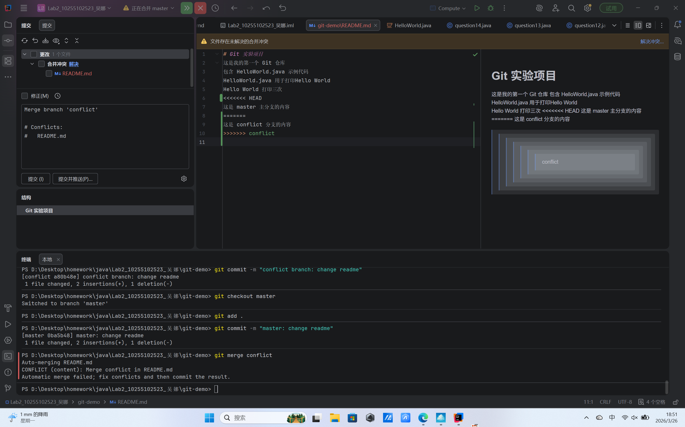
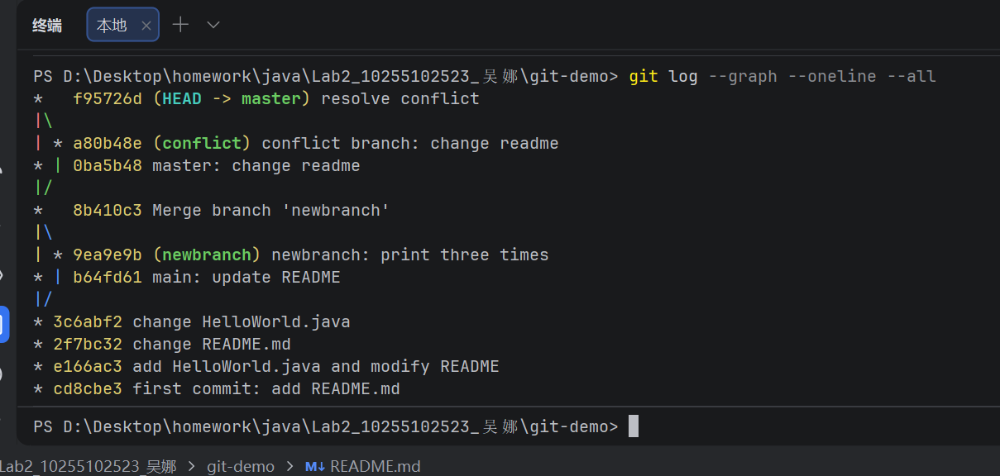

# Git 实验项目
这是我的第一个 Git 仓库
包含 HelloWorld.java 示例代码     
HelloWorld.java 用于打印Hello World   
Hello World 打印三次
我的 Git 实验项目
## question3
状态变化
第一次仓库状态为工作区干净，无任何未提交修改；第二次仓库出现已追踪文件的修改（README.md）和未追踪的新文件（HelloWorld.java）。   
新增信息说明
modified: README.md 表示该文件是 Git 已追踪文件，内容发生了修改，但未加入暂存区。
Untracked files: HelloWorld.java 表示该文件是新增文件，Git 尚未对其进行版本追踪。
## question5
实现这个操作的是 Git 的暂存区功能。
## question7

1. 合并时发生的事情：   
   当两个分支修改了同一个文件的同一行内容后进行合并，Git 无法自动判断应该保留哪一行，因此会触发合并冲突（Merge Conflict）。合并过程会暂停，提示你需要手动解决冲突后才能继续。
2. <<<<<<<、=======、>>>>>>> 分别的含义：   
   冲突文件里会出现这样的标记：
   plaintext
   <<<<<<< HEAD
   当前分支（你所在分支）修改的内容
   =======
   要合并进来的分支修改的内容
>>>>>>> 分支名
含义：
<<<<<<< HEAD
表示以下是当前所在分支的代码内容。
=======
冲突内容的分隔线，区分两个分支的不同代码。
>>>>>>> 分支名
表示以下是被合并分支的代码内容。

## question8

## question10
克隆仓库测试修改
